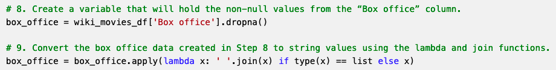
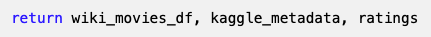

# Movies Extract, Transform and Load

## "Module 8 Challenge"

## Deliverable 1

ETL function written to read in the three data files.

The function converts the Wikipedia JSON file to a Pandas DataFrame, and the DataFrame is displayed in the ETL_function_test.ipynb file. (5 pt)

​The function converts the Kaggle metadata file to a Pandas DataFrame, and the DataFrame is displayed in the ETL_function_test.ipynb file.

The conversion to DF was done on "ETL_function_test.ipynb" file's step # 8.

​The function converts the MovieLens ratings data file to a Pandas DataFrame, and the DataFrame is displayed in the ETL_function_test.ipynb file.

The conversion to DF was done on "ETL_function_test.ipynb" file's step # 8.

## Deliverable 2

The TV shows are filtered out, and the wiki_movies_df DataFrame is created.

A try-except block is used to catch errors while extracting the IMDb IDs with a regular expression and dropping duplicate IDs.

The extraction and transformation of the Wikipedia data in the ETL function does the following:

* A list comprehension is used to keep columns with non-null values.

* The non-null box office data is converted to string values using the lambda and join functions.

* A regular expression is used to match the six elements of "form_one" of the box office data.

* A regular expression is used to match the three elements of "form_two" of the box office data.

The following columns are cleaned in the Wikipedia DataFrame:

* The box office column

* The budget column

* The release date column

* The running time column
​

The cleaned Wikipedia data is converted to a Pandas DataFrame, and the DataFrame is displayed in the ETL_clean_wiki_movies.ipynb file.

## Deliverable 3

The extraction and transformation of the Kaggle metadata using the ETL function does the following:
The Kaggle metadata is cleaned. (4 pt)

The Wikipedia and Kaggle DataFrames are merged. (3 pt)
The following is performed on the merged Wikipedia and Kaggle DataFrames to create the movies_df: (8 pt)

* Unnecessary columns are dropped.
* A function is used to fill in the missing Kaggle data.
* The movies_df DataFrame is filtered to keep specific columns.
* The movies_df DataFrame columns are renamed.

The extraction and transformation of the MovieLens ratings data using the ETL function does the following:

* The ratings counts are cleaned. (3 pt)
* The movies_df DataFrame is merged with the cleaned ratings DataFrame to create the * movies_with_ratings_df DataFrame. (4 pt)
* The empty values in the movies_with_ratings_df DataFrame are filled with “0”. (3 pt)

The movies_with_ratings_df and the movies_df DataFrames are displayed in the ETL_clean_kaggle_data.ipynb file. (5 pt)

## Deliverable 4

You will earn a perfect score for Deliverable 4 by completing all requirements below:

The data from the movies_df DataFrame replaces the current data in the movies table in the SQL database, as determined by the movies_query.png. (5 pt)

The data from the MovieLens rating CSV file is added to the ratings table in the SQL database, as determined by the ratings_query.png. (5 pt)

The elapsed time to add the data to the database is displayed in the ETL_create_database.ipynb file. (5 pt)

